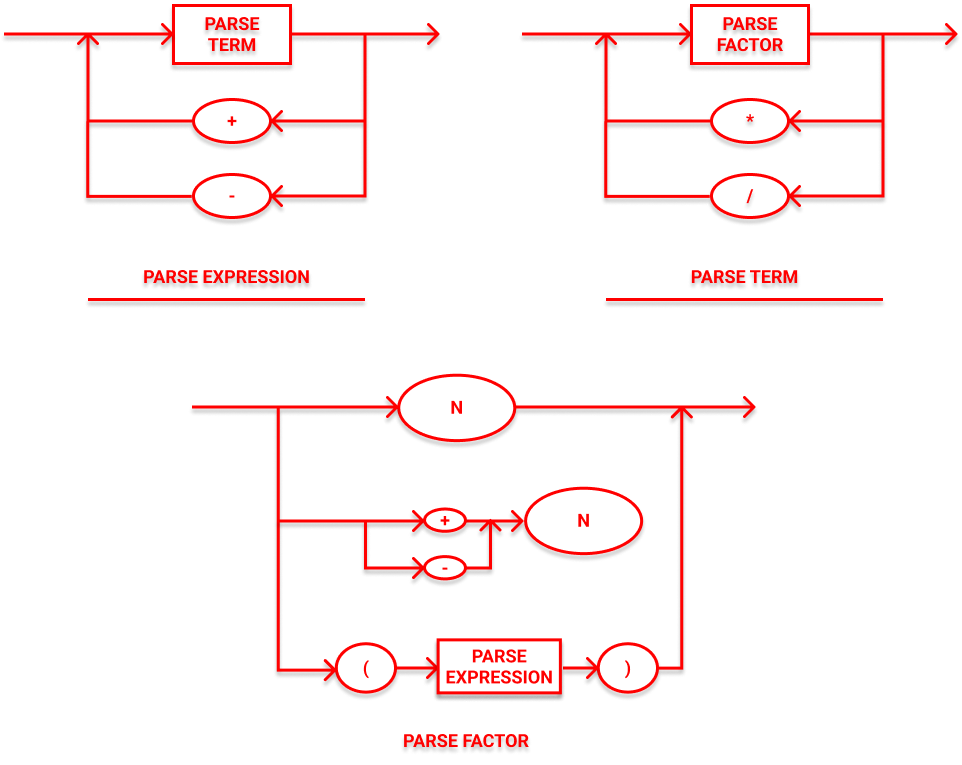

# Projeto Lógica da Computação


## Testes de Unidade

```shell
$ python3.8 -m pytest -v --no-header 
```

## Diagrama Sintático



## EBNF

```
BLOCK = "{" , STATEMENT , "}";

STATEMENT =  (λ | ASSIGNMENT | BLOCK | PRINT | IF | WHILE) , ";";

REL_EXPRESSION = EXPRESSION, { ("==" | "<" | ">") , EXPRESSION };

EXPRESSION = TERM, { ("+" | "-" | "||") , TERM };

TERM = FACTOR, { ("*" | "/" | "&&") };

FACTOR = INT | IDENTIFIER | (("+" | "-" | "!") , FACTOR) | "(", REL_EXPRESSION , ")" | SCANF;

ASSIGNMENT = IDENTIFIER , "=" , EXPRESSION;

PRINT = "printf" , "(" , EXPRESSION , ")";

IF = "if" , "(" , REL_EXPRESSION, ")" , STATEMENT, { ("else" , STATEMENT) | λ };

WHILE = "while" , "(" , REL_EXPRESSION , ")" , STATEMENT;

SCANF = "scanf" , "(" , ")";

INT = DIGIT , { DIGIT };

IDENTIFIER = LETTER , { LETTER | DIGIT | "_" };

DIGIT = ( 0 | 1 | 2 | 3 | 4 | 5 | 6 | 7 | 8 | 9 );

LETTER = (a | b | c | d | ... x | y | z | A | B | ... | Y | Z );
```

## Figma

[Clique aqui](https://www.figma.com/file/FwgHMDOpuHXPAxmSICtWKg/Diagrama-Lógica-de-Computação) para visualizar o diagrama no Figma.
