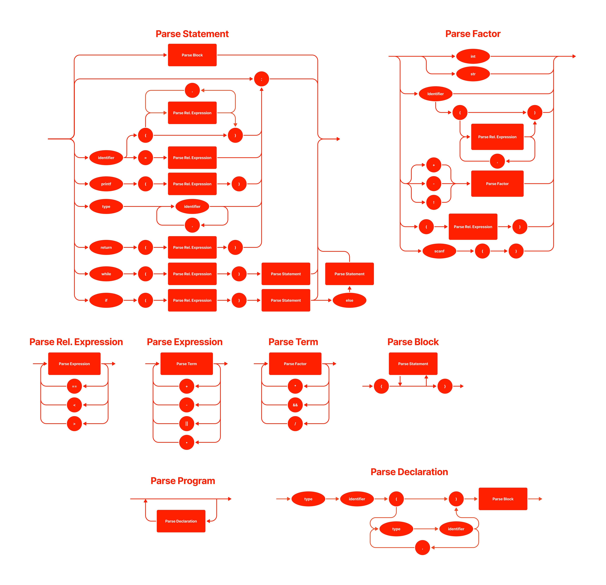

# Projeto Lógica da Computação


## Testes de Unidade

```shell
$ python3.8 -m pytest -v --no-header 
```

## Diagrama



## Figma

[Clique aqui](https://www.figma.com/file/FwgHMDOpuHXPAxmSICtWKg/Diagrama-Lógica-de-Computação) para visualizar o diagrama no Figma.
